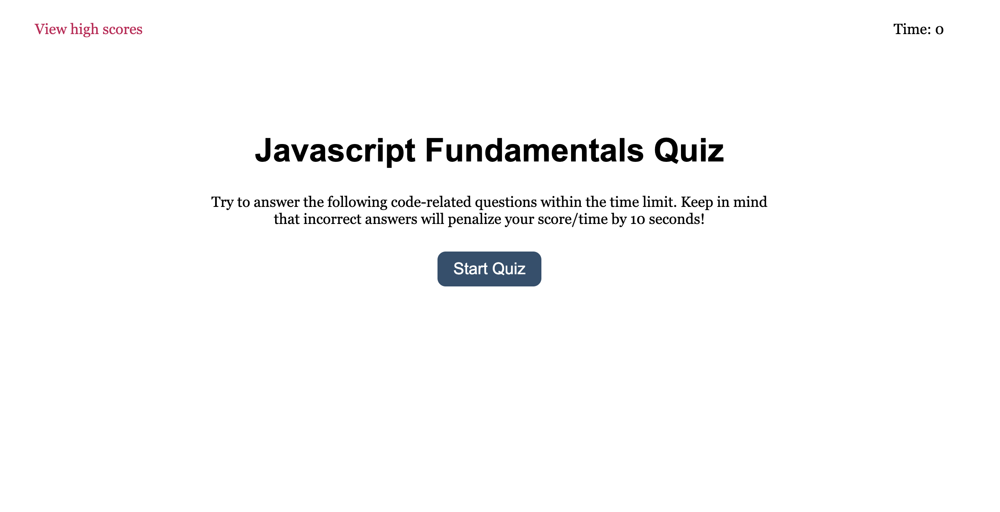
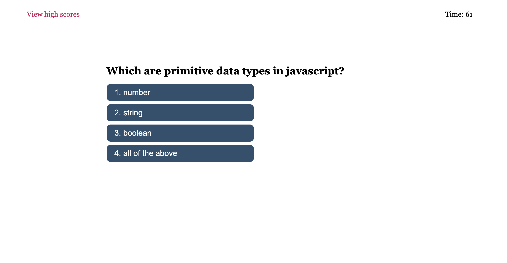
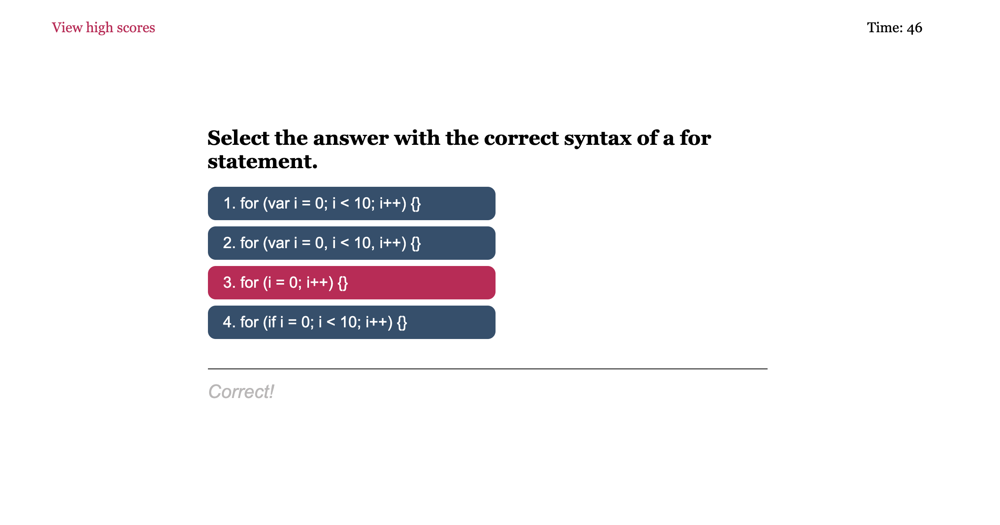
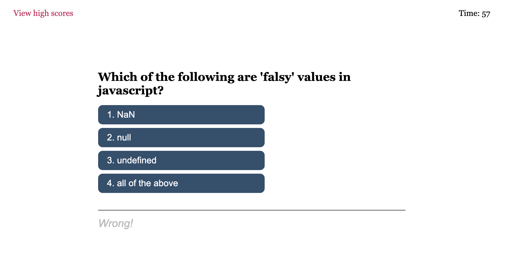
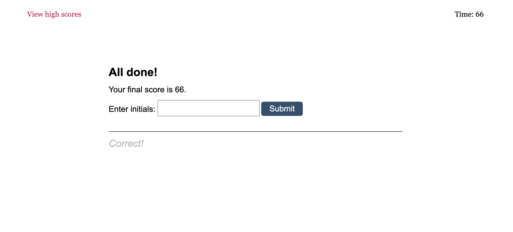
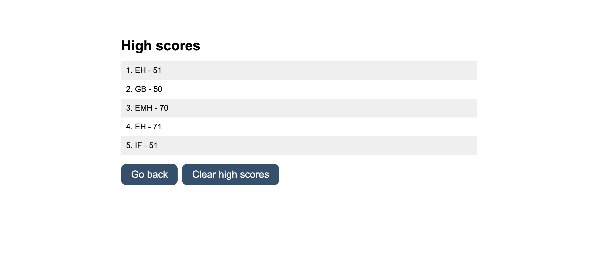

# Javascript Fundamentals Quiz
## Week 4: Web API Challenge

This repository contains the code for a short quiz covering javascript fundamentals. 
The purpose of this coding challenge is to highlight my knowledge of javascript Web APIs to dynamically update HTML and CSS. 

Brief overview of what to expect with this quiz: 
1. Once the quiz has started a timer/countdown will begin. 
2. The user will have 75 seconds to answer all questions. The timer will determine the users final score. 
3. If the user answers incorrectly, 10 points will be deducted from the timer. 
4. The quiz is over once all questions have been answered or the timer reaches 0. 
5. The user can save their high score via localStorage and take quiz again. 

View the quiz here: https://emholmes.github.io/eholmes-js-quiz-api-challenge/ (deployed application)

 
 

